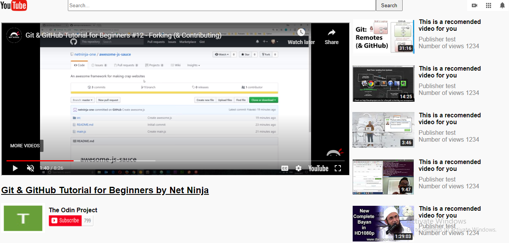

# YouTube Clone Page - Microverse Project

> This is our first project for Microverse.

## Built With

- HTML & CSS

## Live Demo

[Live Demo Link](https://anapdh.github.io/YouTubeClonePage/)

## Authors

👩🏼‍💻 **Ana Paula Hübner**

- GitHub: [@anapdh](https://github.com/anapdh)
- Twitter: [@anapdh](https://twitter.com/anapdh)
- LinkedIn: [LinkedIn](https://www.linkedin.com/in/ana-paula-hübner-7a9484181)

👨🏻‍💻 **Mohd Nayeem Shah**

- GitHub: [@shahnaeem](https://github.com/shahnaeem)
- Twitter: [@mohdnayeemshah1](https://twitter.com/MOHDNAYEEMSHAH1)
- LinkedIn: [LinkedIn](https://linkedin.com/in/mohd-nayeem-shah-97a590152)

## 🤝 Contributing

Contributions, issues, and feature requests are welcome!

Feel free to check the [issues page](issues/).

## Show your support

Give a ⭐️ if you like this project!

## 📝 License

This project is [MIT](lic.url) licensed.
